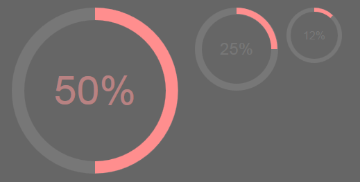

# css-percentage-circle
Pure CSS Percentage Circle

The idea comes from André Firchow, who developed this circle. A demo of this, can be found <a href="http://circle.firchow.net/" target="_blank">here</a>, whereas the corresponding post that he blogged about, can be found <a href="http://firchow.net/css3-prozentanzeige-kreis/" target="_blank">here</a>.

What I only changed in the original project, is the support for a light pink-like color (<code>#FF8E8E</code>); I actually replaced the existing blue one with the one I'm using in the "Skills" section of my <a href="http://thodorisbais.com/">website</a>, which looks like this:

  

