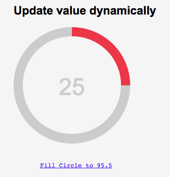
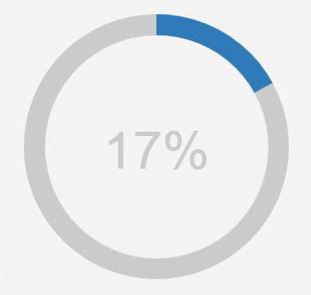

# percircle
> CSS percentage circle built with jQuery

# [Demo](https://thodorisbais.github.io/percircle)


> ## [Maintainers Wanted!](https://github.com/toubou91/percircle/issues/43)
---

### Custom circles
```html
<div id="custom" class="yellow big"></div> 
<div id="clock" class="purple big"></div>
<div id="custom-color" class="big"></div>
<div id="countdown" class="big"></div>
```
<p align="center">
  
</p>
<hr>

### Update value dynamically

#### Declare your html

```html
<div class="clearfix">
    <div id="redBecomesBlue" class="red big"></div>
</div>
<a href="javascript:void(0);" id="changeCircle">Fill Circle to 95.5</a>
```
<p align="center">
  
</p>

#### Handle the click in the script
```js
$(document).ready(function(){
    $("#redBecomesBlue").percircle({percent: 25,text: "25"});
    $('#changeCircle').click(function(e){
        e.preventDefault();
        changeCircle();
    });
});

function changeCircle(){
    $("#redBecomesBlue").percircle({text:''});
    $("#redBecomesBlue").percircle({
        text: "",
        percent: 95.5,
        progressBarColor: "#1252c0"
    });
}
```
<hr/>

# Usage

#### 1. Load the module to your page
```html
<!DOCTYPE HTML>
<html>
<head>
  <script src="../bower_components/jquery/dist/jquery.min.js"></script>
  <script type="text/javascript" src="../dist/js/percircle.js"></script>
  <link rel="stylesheet" href="../dist/css/percircle.css">
</head>
</html>
```

#### 2. Define the circle objects
Big blue circle marked with a percent of 50%:
```html
<div id="bluecircle" data-percent="17" class="big">
</div>
```
<p align="center">
  
</p>

#### 3. Let the script get the job done
```html
<script type="text/javascript">
    $(function(){
        $("#bluecircle").percircle();
    });
</script>
```
<hr>

### npm
Percircle is registered as an npm package and can be installed with:
```
npm install percircle
```

### Bower
Percircle is also registered as a Bower package, so it can be pulled down using:
```
bower install percircle
```

### Building Percircle Locally

If you'd like to run the development version, `percirle` uses Gulp to automate basic tasks, like building.  Head over to https://github.com/gulpjs/gulp/blob/master/docs/getting-started.md for more information.  First, clone the repository, then run:

    npm install -g gulp
    npm install

    # Watches the js files for changes, while linting them concurrently 
    gulp watch

    # Runs jshint and builds a minified version of the files.
    gulp

### Contribute
Contributions are more than welcome. Please ensure that you spent some time reading our [Contributor's Guidelines](https://github.com/toubou91/percircle/blob/master/CONTRIBUTING.md).

### Contributors
[](https://github.com/toubou91) |[](https://github.com/chrisahardie) |[](https://github.com/chris--jones) |[](https://github.com/tinglu) |[](https://github.com/tranthanhhoa) |[](https://github.com/ahmadajmi) |[](https://github.com/Sylphony) |[](https://github.com/yireo) |
:---:|:---:|:---:|:---:|:---:|:---:|:---:|:---:|
[toubou91](https://github.com/toubou91)|[chrisahardie](https://github.com/chrisahardie)|[chris--jones](https://github.com/chris--jones)|[tinglu](https://github.com/tinglu)|[tranthanhhoa](https://github.com/tranthanhhoa)|[ahmadajmi](https://github.com/ahmadajmi)|[Sylphony](https://github.com/Sylphony)|[yireo](https://github.com/yireo)|

### Credits
The original project was created from <a href="http://circle.firchow.net/" target="_blank">Andre Firchow</a> and as I didn't find any similar here, I uploaded it.

However, the project loaded all the css transformations, in the <code>percircle.css</code> file. Now, it uses jQuery to apply repeated functionality where needed.
