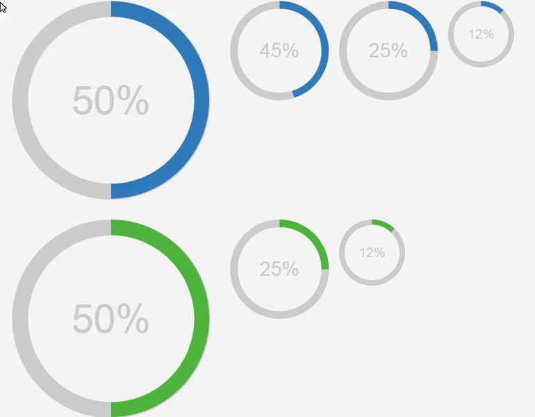
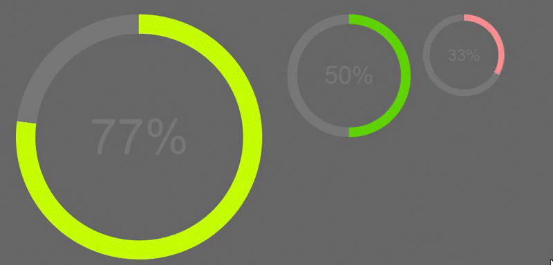
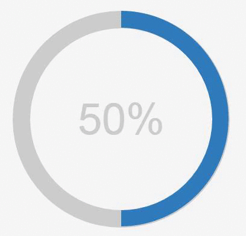
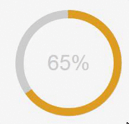
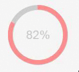

# percircle
> CSS Percentage Circle

#Demo
Default circles:
<p align="center">
  
</p>

Dark circles:
<p align="center">
  
</p>

#Usage
####Load the module to your page
```html
<!DOCTYPE HTML>
<html>
<head>
  <script src="https://code.jquery.com/jquery-2.1.4.min.js"></script>
  <script type="text/javascript" src="js/percircle.js"></script>
  <link rel="stylesheet" href="css/percircle.css">
</head>
</html>
```

#### Define the circle objects
Big blue circle marked with a percent of 50%:
```html
<div data-percircle="50" class="c100 big">
    <span>50%</span>
    <div class="slice">
        <div class="bar"></div>
        <div class="fill"></div>
    </div>
</div>
```
<p align="center">
  
</p>
<hr>

Default orange circle marked with a percent of 65%:
```html
<div data-percircle="65" class="c100 orange">
    <span>65%</span>
    <div class="slice">
        <div class="bar"></div>
        <div class="fill"></div>
    </div>
</div>
```
<p align="center">
  
</p>
<hr>

Small pink circle marked with a percent of 82%:
```html
<div data-percircle="82" class="c100 small pink">
    <span>82%</span>
    <div class="slice">
        <div class="bar"></div>
        <div class="fill"></div>
    </div>
</div>
```

<p align="center">
  
</p>


#Contribute
Feel free to submit a pull request for the <a href="https://github.com/toubou91/percircle/issues" target="_blank">existing</a> issues or even introduce bugs/enhancements by opening a <a href="https://github.com/toubou91/percircle/issues/new" target="_blank">new</a> issue.

#Credits
The original project was created from <a href="http://circle.firchow.net/" target="_blank">Andre Firchow</a> and as I didn't find any similar here, I uploaded it.

However, the project loaded all the css transformations, in the <code>percircle.css</code> file. Now, it makes use of the <a href="https://api.jquery.com/category/selectors/" target="_blank">jQuery selectors</a> in order to do so.
