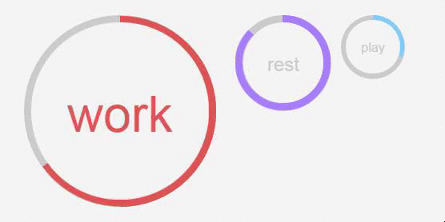
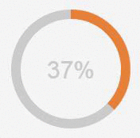
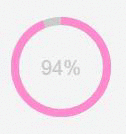
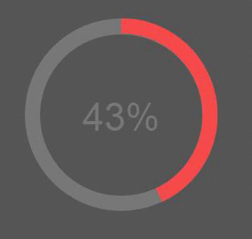

# percircle
> CSS percentage circle built with jQuery

#Demo
Dark circles:
<p align="center">
  
</p>

Custom circles:
<p align="center">
  
</p>

Default circles:
<p align="center">
  
</p>

#Usage
####1. Load the module to your page
```html
<!DOCTYPE HTML>
<html>
<head>
  <script src="../bower_components/jquery/dist/jquery.min.js"></script>
  <script type="text/javascript" src="../dist/js/percircle.js"></script>
  <link rel="stylesheet" href="../dist/css/percircle.css">
</head>
</html>
```

####2. Define the circle objects
Big blue circle marked with a percent of 50%:
```html
<div id="bluecircle" data-percent="17" class="big">
</div>
```
<p align="center">
  
</p>
<hr>

Default orange circle marked with a percent of 37%:
```html
<div id="orangecircle" data-percent="37" class="orange">
</div>
```
<p align="center">
  
</p>
<hr>

Small pink circle marked with a percent of 94%:
```html
<div id="pinkcircle" data-percent="94" class="small pink">
</div>
```

<p align="center">
  
</p>
<hr>

Big red dark circle, 43% filled, without animation:
```html
<div id="redcircle" data-percent="43" data-animate="false" class="dark red big">
</div>
```

<p align="center">
  
</p>
<hr>
####3. Let the script get the job done
```html
<script type="text/javascript">
    $(function(){
        $("[id$='circle']").percircle();
    });
</script>
```
<hr>

###Custom circles
```html
<div id="custom" class="yellow big"></div> 
<div id="clock" class="purple big"></div>
<div id="custom-color" class="big"></div>
<div id="countdown" class="big"></div>
```
<p align="center">
  
</p>
<hr>

###npm
Percircle is registered as an npm package and can be installed with:
```
npm install percircle
```

###Bower
Percircle is also registered as a Bower package, so it can be pulled down using:
```
bower install percircle
```

### Building Percircle Locally

If you'd like to run the development version, `percirle` uses Gulp to automate basic tasks, like building.  Head over to https://github.com/gulpjs/gulp/blob/master/docs/getting-started.md for more information.  First, clone the repository, then run:

    npm install -g gulp
    npm install

    # Watches the js files for changes, while linting them concurrently 
    gulp watch

    # Runs jshint and builds a minified version of the files.
    gulp

#Contribute
Feel free to submit a pull request for the <a href="https://github.com/toubou91/percircle/issues" target="_blank">existing</a> issues or even introduce bugs/enhancements by opening a <a href="https://github.com/toubou91/percircle/issues/new" target="_blank">new</a> issue.

#Credits
The original project was created from <a href="http://circle.firchow.net/" target="_blank">Andre Firchow</a> and as I didn't find any similar here, I uploaded it.

However, the project loaded all the css transformations, in the <code>percircle.css</code> file. Now, it uses jQuery to apply repeated functionality where needed.
